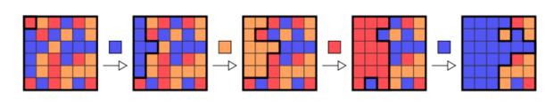

# Alcemy Python Coding Task

Your future role will involve making pull requests on production code and working on multiple code repositories maintained by multiple developers. Hence, we want to test how well you are able to abstract a problem and turn it into code that is readable and usable by others. It is up to you to define and to control the scope. Please, focus on the most important aspects of the task. Proceed in an incremental way using small steps. Ensure that your solution can be executed. Focus on clean, readable code and proper testing.

This exercise should take no more than 4-6 hours of actual developing time. It would be great if you could complete this task within a week, but it is no problem if you need more time - just let us know. We provide this time limit, to make clear how much time we expect you to spend on this task at most, because we know you have other things to do. You can do this at your own pace and with your own tools.

## Problem Description

Your task is to implement a simple game and solver for a popular single-player game. The player is given an n × n board of tiles where each tile is randomly given one of m colors. Each tile is connected to up to four adjacent tiles in the North, South, East, and West directions. A tile is connected to the origin (the tile in the upper left corner) if it has the same color as the origin and there is a connected path to the origin consisting only of tiles of this color. A player makes a move by choosing one of the m colors. After the choice is made, all tiles that are connected to the origin are changed to the chosen color. The game proceeds until all tiles of the board have the same color.

Figure 1: A possible sequence of moves together with the chosen color on a 6 x 6 board initially filled with 3 distinct colors.

The goal of the game is to change all the tiles to the same color, preferably with the fewest number of moves possible. While finding the optimal moves is a very hard computational problem [https://arxiv.org/abs/1001.4420], you can already achieve good results using a simple heuristic.

## The Task

The task is to implement a very simple greedy strategy to solve the game:

● For each move, choose the color that will result in the largest gain of tiles connected to the origin.

● Ties should be resolved deterministically, e.g. based on the lowest rank of the color when representing them with integers.

● Hint: this can be achieved by implementing a depth-first search to find all tiles connected to the origin. You can also draw inspiration from the flood fill algorithm: https://en.wikipedia.org/wiki/Flood_fill

Please implement the game and an automated player that determines the color choice for each move. Determine the amount of moves and the sequence of the colors chosen by the player over the course of a game. The goal is not to find the most efficient solution but a clean solution that works. Please focus more on code quality instead of fancy algorithms.

Please, write unit tests to show that your code is working properly. There is no need to implement any kind of graphical user interface.

Please, use Python 3.7+ to implement your solution. Please, do not publish your result in a public github repository. Send your solution as a zip file.

## Definition of Done

● The resulting software is executable, solves the problem, and can be tested by us.

● There should be a main.py file that can be executed by us and takes the board size n and number of colors m as arguments. It should print the steps taken to solve the problem.

● Unit tests are given that demonstrate the correctness of your code.

● The code adheres to high quality standards, best practices (PEP8), follows a common formatting and a clear structure. The code is easy to read, easy to maintain, and to extend.

● There is a Readme file that describes how to run and test the code.

All the best and happy coding!
